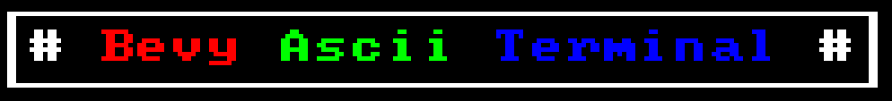
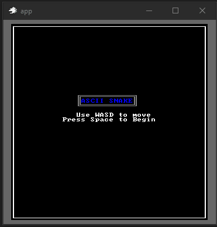
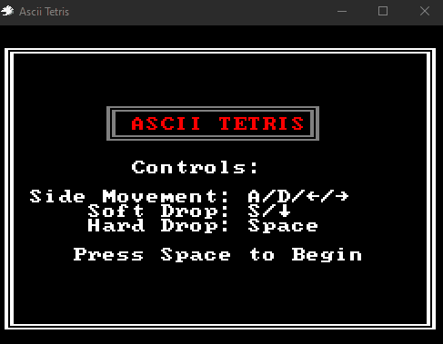

[](https://opensource.org/licenses/MIT)
[](https://crates.io/crates/bevy_ascii_terminal/)
[](https://docs.rs/bevy_ascii_terminal/)

# `Bevy Ascii Terminal`

A simple ascii terminal integrated into bevy's ecs framework.

---


---

The goal of this crate is to provide a simple, straightforward, and hopefully
fast method for rendering colorful ascii in bevy. It was made with "traditional
roguelikes" in mind, but should serve as a simple UI tool if needed.

# Code Example

```rust
use bevy::prelude::*;
use bevy_ascii_terminal::*;

fn main() {
    App::new()
        .add_plugins((DefaultPlugins, TerminalPlugins))
        .add_systems(Startup, setup)
        .run();
}

fn setup(mut commands: Commands) {
    commands.spawn((
        Terminal::new([12, 1]).with_string([0, 0], "Hello world!".fg(color::BLUE)),
        TerminalBorder::single_line(),
    ));
    commands.spawn(TerminalCamera::new());
}
```

## Versions
| bevy  | bevy_ascii_terminal |
| ----- | ------------------- |
| 0.17  | 0.18                |
| 0.16  | 0.17.*              |
| 0.15  | 0.16.*              |
| 0.13  | 0.15.0              |
| 0.12  | 0.14.0              |
| 0.11  | 0.13.0              |
| 0.9   | 0.12.1              |
| 0.8.1 | 0.11.1-4            |
| 0.8   | 0.11                |
| 0.7   | 0.9-0.10            |

## Bevy Ascii Terminal Projects
 _(Note these were built on earlier versions and haven't been updated in a while)_

**Bevy Roguelike** - [Source](https://github.com/sarkahn/bevy_roguelike/) - [WASM](https://sarkahn.github.io/bevy_rust_roguelike_tut_web/)

**Ascii Snake** - [Source](https://github.com/sarkahn/bevy_ascii_snake/) - [WASM](https://sarkahn.github.io/bevy_ascii_snake/)

**Ascii Tetris** - [Source](https://github.com/sarkahn/bevy_ascii_tetris/) - [WASM](https://sarkahn.github.io/bevy_ascii_tetris/)

[](https://github.com/sarkahn/bevy_roguelike/)
[](https://github.com/sarkahn/bevy_ascii_snake)
[](https://github.com/sarkahn/bevy_ascii_tetris/)

## Credits

Built in fonts were put together from various sources and modified only to make them uniform by changing background colors and adding the empty box drawing character from rexpaint (`□`):
- Px437 - https://int10h.org/oldschool-pc-fonts/
- ZxEvolution - https://www.gridsagegames.com/rexpaint/resources.html
- Pastiche - https://dwarffortresswiki.org/index.php/DF2014:Tileset_repository
- Rexpaint - https://www.gridsagegames.com/rexpaint/resources.html
- Unscii - https://github.com/viznut/unscii
- Taffer - https://dwarffortresswiki.org/index.php/DF2014:Tileset_repository
- TaritusCurses - https://dwarffortresswiki.org/index.php/DF2014:Tileset_repository
- JtCurses - https://dwarffortresswiki.org/index.php/DF2014:Tileset_repository
- SazaroteCurses - Unknown

Rexpaint loader - https://docs.rs/rexpaint/latest/rexpaint/